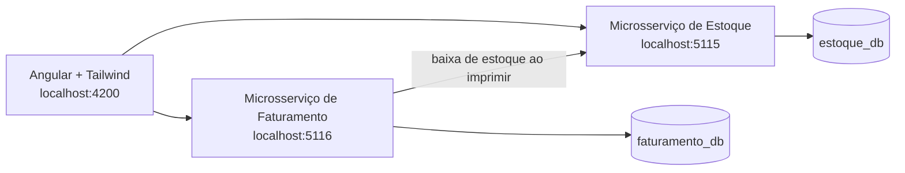

# Emissão de Notas Fiscais

 O sistema permite cadastrar produtos, emitir notas fiscais com múltiplos itens, baixar o estoque ao imprimir a nota e apresentar uma interface web simples para a operação.

## Visão geral da solução

O projeto é composto por dois microsserviços independentes, cada um com seu próprio banco PostgreSQL, e um frontend Angular.



| Componente | Responsabilidade |
| --- | --- |
| `frontend/angular-nfes` | Interface para consulta e cadastro de produtos e notas fiscais. |
| `microserv1_est` | Cadastro, consulta e baixa de estoque. |
| `microserv2_fatu` | Emissão, consulta e impressão de notas fiscais. |

## Funcionalidades entregues

- Cadastro de produto com código, descrição e saldo em estoque.
- Listagem e consulta de produtos.
- Emissão de nota fiscal com numeração sequencial, status `Open` e vários produtos/quantidades.
- Impressão disponível apenas para notas abertas.
- Fechamento da nota após uma impressão realizada com sucesso.
- Baixa do estoque dos itens ao imprimir a nota.
- Bloqueio de saldo insuficiente e de produtos inexistentes.
- Retorno amigável quando o microsserviço de estoque estiver indisponível; a nota permanece aberta e pode ser impressa novamente quando o serviço voltar.
- Tratamento de concorrência para impedir que duas notas consumam simultaneamente a última unidade de um produto.

## Detalhamento técnico

### Frontend

O frontend foi construído com **Angular 21**, TypeScript e **Tailwind CSS 4**. A interface utiliza uma paleta corporativa em azul escuro, vermelho e branco, sem biblioteca visual de componentes de terceiros; o Tailwind foi escolhido para manter o projeto pequeno e permitir composições visuais responsivas diretamente nos templates.

O componente principal usa o ciclo de vida `ngOnInit` para carregar os dados iniciais apenas no navegador, preservando a compatibilidade com SSR. O estado da interface é mantido com Angular Signals, que controlam a aba ativa, dados carregados, mensagens de sucesso/erro, formulários e estados de processamento.

O **RxJS** é usado nos fluxos de comunicação HTTP:

- `HttpClient` retorna `Observable` para os endpoints dos dois microsserviços.
- `forkJoin` carrega produtos e notas em paralelo no painel.
- `catchError` permite que a tela continue funcionando e exiba feedback caso uma das APIs esteja indisponível.
- `of` fornece valores de fallback no erro, e `subscribe` atualiza a interface quando a resposta chega.

O `FormsModule` fornece o binding dos formulários de produto e nota fiscal por meio de `ngModel`. O serviço `NfeApiService` centraliza as URLs e as chamadas HTTP, evitando acoplamento entre os componentes e as APIs.

### Backend e frameworks

Os dois microsserviços foram implementados em **C# com .NET 10 e ASP.NET Core Web API**. A separação em controllers, services, DTOs, entidades e contextos de dados mantém as responsabilidades claras para o porte do teste.

| Biblioteca | Uso no projeto |
| --- | --- |
| ASP.NET Core | Endpoints REST, injeção de dependência, validação de modelo, CORS e health checks. |
| Entity Framework Core | Persistência, migrations e consultas ao PostgreSQL. |
| Npgsql | Provider PostgreSQL para o Entity Framework Core. |
| DotNetEnv | Carregamento de variáveis locais a partir de `.env`, sem versionar credenciais. |
| Swashbuckle | Swagger/OpenAPI disponível em ambiente de desenvolvimento. |

Não há código Go neste projeto; por isso, o item de gerenciamento de dependências Go do enunciado não se aplica. As dependências C# são declaradas nos arquivos `.csproj` e restauradas pelo .NET SDK.

### LINQ e persistência

O LINQ é utilizado nas regras de negócio e consultas do EF Core. Exemplos incluem projeção de entidades para DTOs com `Select`, ordenação de listagens com `OrderBy`, validações com `AnyAsync`, agrupamento dos itens repetidos de uma nota com `GroupBy`, consolidação de quantidades e criação de dicionários para localizar os produtos envolvidos na baixa.

Cada microsserviço possui seu próprio `DbContext` e banco físico PostgreSQL:

- Estoque: banco `estoque_db`, migration `InitialCreate`.
- Faturamento: banco `faturamento_db`, migration `InitialCreate`.

As migrations do Entity Framework permitem recriar o esquema de forma reproduzível com `dotnet ef database update`.

### Tratamento de erros e falhas entre microsserviços

Um middleware global transforma exceções de regra de negócio em respostas padronizadas no formato `{ statusCode, message }`. A validação automática dos DTOs também retorna mensagens objetivas para entradas inválidas.

No fluxo de impressão, o faturamento chama o endpoint de baixa do estoque por `HttpClient`. Se o estoque retornar saldo insuficiente, produto inválido ou estiver indisponível, a nota **não é fechada**. Em indisponibilidade de rede ou timeout, o faturamento retorna `503 Service Unavailable` com uma mensagem de orientação. Assim que o serviço de estoque voltar, o usuário pode tentar imprimir a mesma nota novamente, sem perder o cadastro nem baixar estoque indevidamente.

### Tratamento de concorrência

O cenário opcional de concorrência foi implementado no microsserviço de estoque. A baixa ocorre em uma transação de banco e bloqueia, em ordem determinística de identificador, as linhas de produtos envolvidas usando `SELECT ... FOR UPDATE` do PostgreSQL. Depois do bloqueio, o saldo é validado e atualizado; em seguida a transação é confirmada. Se duas notas disputarem um produto com saldo `1`, apenas a primeira baixa terá sucesso; a outra aguardará o bloqueio, encontrará saldo insuficiente e receberá `409 Conflict`.

Essa estratégia evita saldo negativo e também reduz o risco de deadlock quando há vários produtos na mesma solicitação, pois os bloqueios são sempre solicitados na mesma ordem.

### Segurança e dados locais

Credenciais e configurações locais não são versionadas. Os arquivos `.env`, variantes de ambiente, certificados e arquivos de build estão cobertos pelo `.gitignore`. Os arquivos `.env.example` contêm apenas valores de exemplo, que devem ser substituídos localmente. Nenhuma senha ou string de conexão real deve ser incluída no repositório público.

## Endpoints principais

| Serviço | Método e rota | Finalidade |
| --- | --- | --- |
| Estoque | `POST /api/produtos` | Cadastra produto. |
| Estoque | `GET /api/produtos` | Lista produtos. |
| Estoque | `GET /api/produtos/{id}` | Consulta produto. |
| Estoque | `POST /api/produtos/baixar-estoque` | Baixa itens de forma transacional. |
| Faturamento | `POST /api/notas-fiscais` | Emite nota aberta. |
| Faturamento | `GET /api/notas-fiscais` | Lista notas. |
| Faturamento | `GET /api/notas-fiscais/{id}` | Consulta uma nota. |
| Faturamento | `POST /api/notas-fiscais/{id}/imprimir` | Baixa estoque e fecha a nota. |
| Ambos | `GET /health` | Verifica a disponibilidade do serviço. |

## Como executar

### Pré-requisitos

- .NET SDK 10.
-  npm.
- PostgreSQL em execução.
- Ferramenta `dotnet-ef`, caso ainda não esteja instalada: `dotnet tool install --global dotnet-ef`.

### 1. Configurar variáveis locais

Em cada microsserviço, copie `.env.example` para `.env` e preencha as variáveis com suas conexões locais. No faturamento, configure também `ESTOQUE_API_BASE_URL` apontando para o serviço de estoque. 

### 2. Criar ou atualizar os bancos

Em terminais separados:

```powershell
cd microserv1_est
dotnet ef database update

cd ..\microserv2_fatu
dotnet ef database update
```

### 3. Iniciar as APIs

```powershell
cd microserv1_est
dotnet run --urls http://localhost:5115

cd ..\microserv2_fatu
dotnet run --urls http://localhost:5116
```

### 4. Iniciar o frontend

```powershell
cd frontend\angular-nfes
ng serve
```

Abra `http://localhost:4200`. Em desenvolvimento, o Swagger fica disponível nas APIs quando `ASPNETCORE_ENVIRONMENT=Development` estiver configurado.

## Roteiro de demonstração

1. Cadastre um produto com saldo disponível.
2. Crie uma nota fiscal com um ou mais itens.
3. Imprima a nota e confirme que o status muda de `Open` para `Closed` e o saldo diminui.
4. Tente imprimir uma nota fechada para observar o bloqueio.
5. Pare o serviço de estoque, tente imprimir uma nova nota e observe o feedback de indisponibilidade.
6. Inicie o estoque novamente e repita a impressão da mesma nota aberta.
7. Para testar concorrência, use duas solicitações simultâneas de baixa para um produto com saldo `1`; apenas uma deve concluir.


